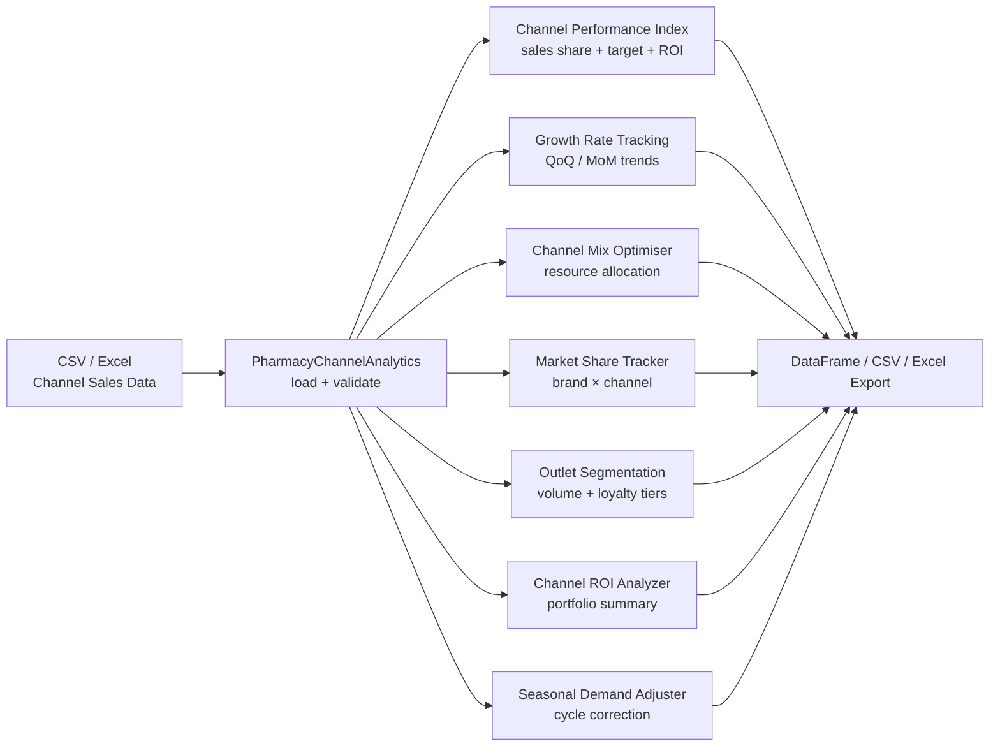

# Pharmacy Channel Analytics


> Retail, hospital, institutional, and online pharmacy channel performance analytics — Channel Performance Index (CPI), period-over-period growth, channel mix optimisation, concentration (HHI) and Pareto 80/20 ranking, ROI benchmarking, outlet segmentation, and seasonal demand adjustment.

Built around the reality of the Indonesian pharma distribution landscape (Apotek Kimia Farma, Apotek K-24, Guardian, RS Siloam, hospital tenders, and institutional buyers such as Dinas Kesehatan) but the schema is portable to any retail/hospital pharma market.

---

## ✨ Features

| Module | Description |
|---|---|
| **Channel Performance Index (CPI)** | Composite 0–100 score from sales share, target attainment, and ROI |
| **Growth Rates** | QoQ / MoM growth with trend labels (growing / stable / declining) |
| **Channel Mix Optimiser** | Resource allocation across hospital, retail, online |
| **Channel Concentration Analyzer** | Outlet-level HHI, normalised HHI, effective-number-of-outlets, Pareto 80/20, and retail-vs-hospital split with within-channel HHI |
| **Market Share Tracker** | Brand × channel share evolution |
| **Outlet Segmentation Engine** | Volume + brand-loyalty tiering for pharmacy outlets |
| **Seasonal Demand Adjuster** | Cycle-adjusted target setting |
| **Channel ROI Analyzer** | Promotional spend efficiency, NPV-style portfolio summary |
| **Channel Forecast** | Time-series projection per channel |

---

## 🚀 Quick Start

```bash
git clone https://github.com/achmadnaufal/pharmacy-channel-analytics.git
cd pharmacy-channel-analytics
pip install -r requirements.txt

# Run the CLI demo (CPI + growth on the quarterly dataset)
python3 demo/run_demo.py

# Run the concentration demo (HHI + Pareto + channel split)
python3 demo/run_concentration_demo.py
```

### Quickstart — load the Indonesian pharma sample

```python
import pandas as pd
from src.channel_concentration_analyzer import ChannelConcentrationAnalyzer

df = pd.read_csv("demo/sample_data.csv")

analyzer = ChannelConcentrationAnalyzer()
concentration = analyzer.compute_hhi(df)
pareto       = analyzer.pareto_ranking(df, cutoff=0.80)
split        = analyzer.channel_split(df)

print(concentration.hhi, concentration.band)
print(f"{pareto.outlets_to_cutoff} outlets drive 80% of revenue")
print(split.per_channel)
```

---

## 🧪 Usage

### Python API

```python
from src.main import PharmacyChannelAnalytics

analyzer = PharmacyChannelAnalytics()
df = analyzer.load_data("sample_data/channel_performance.csv")

cpi = analyzer.calculate_channel_performance_index(
    df,
    channel_col="channel",
    sales_col="sales_value",
    target_col="sales_target",
    cost_col="channel_cost",
)
growth = analyzer.get_channel_growth_rates(df)
```

Expected CSV columns for the CPI / growth analyzer:

```
channel, period, sales_value, sales_target, channel_cost, region
```

Expected columns for the concentration analyzer (see `demo/sample_data.csv`):

```
outlet_id, outlet_name, channel_type, city, province, sku,
units_sold, revenue, month, sales_rep
```

Example concentration output:

```text
Outlet Concentration (HHI):
  HHI              : 1,059  (unconcentrated)
  HHI* normalised  : 0.050
  Effective outlets: 9.44
  Active outlets   : 17
  Zero-sales       : 1
  Top outlet share : 20.9%

Pareto 80/20 Ranking:
  10 of 17 outlets (59%) drive 80% of revenue.

Channel Split:
  Dominant channel : hospital (48.4%)
  Channel                 Revenue    Share   Outlets      HHI
  hospital            222,400,000    48.4%         6    2,224
  retail              141,270,000    30.7%        11    1,080
  institutional        96,000,000    20.9%         1   10,000
```

### Demo output

```text
$ python3 demo/run_demo.py
==============================================================
  Pharmacy Channel Analytics — Demo
==============================================================

✓ Loaded 12 channel records from channel_performance.csv
  Channels : ['Hospital', 'Online', 'Retail']
  Periods  : ['2025-Q1', '2025-Q2', '2025-Q3', '2025-Q4']
  Regions  : ['Java', 'National']

✓ Channel Performance Index (CPI):
  Channel           Total Sales   Target Att%     ROI %     CPI  Band
  ----------------------------------------------------------------------
  Hospital            2,135,000        103.6%    911.8%   100.0  Excellent
  Retail                800,000        108.1%    561.2%   100.0  Excellent
  Online                280,000        112.0%    566.7%    77.4  Excellent

✓ Period-over-Period Growth Rates:
  Channel         Period               Sales    Growth %  Trend
  ------------------------------------------------------------
  Hospital        2025-Q1            520,000        base  base_period
  Hospital        2025-Q2            540,000       +3.8%  stable
  Hospital        2025-Q3            510,000       -5.6%  declining
  Hospital        2025-Q4            565,000      +10.8%  growing
  Online          2025-Q1             45,000        base  base_period
  Online          2025-Q2             62,000      +37.8%  growing
  Online          2025-Q3             78,000      +25.8%  growing
  Online          2025-Q4             95,000      +21.8%  growing
  Retail          2025-Q1            180,000        base  base_period
  Retail          2025-Q2            195,000       +8.3%  growing
  Retail          2025-Q3            205,000       +5.1%  growing
  Retail          2025-Q4            220,000       +7.3%  growing

✓ Channel Ranking Summary:
  Top performer    : Hospital — CPI 100.0 (Excellent)
                     Sales $2,135,000 | Target attainment 103.6% | ROI 911.8%
  Needs attention  : Online — CPI 77.4 (Excellent)
                     Sales $280,000 | Target attainment 112.0% | ROI 566.7%

==============================================================
  ✅ Demo complete
==============================================================
```

---

## 🏗 Architecture



---

## 🛠 Tech Stack

- **Python 3.9+**
- **pandas / numpy** — analytics
- **pytest** — 165-test suite
- **openpyxl** — Excel I/O

---

## 📁 Project Structure

```
pharmacy-channel-analytics/
├── channel_analyzer.py             # Top-level analyzer entrypoint
├── channel_performance_analyzer.py
├── src/
│   ├── channel_roi_analyzer.py
│   ├── channel_mix_optimizer.py
│   ├── channel_concentration_analyzer.py   # HHI + Pareto + channel split
│   ├── outlet_segmentation_engine.py
│   ├── market_share_tracker.py
│   ├── seasonal_demand_adjuster.py
│   ├── channel_forecast.py
│   └── ...
├── sample_data/                    # CSV samples for demo
├── demo/
│   ├── run_demo.py                 # CPI + growth demo
│   ├── run_concentration_demo.py   # HHI + Pareto + channel split demo
│   └── sample_data.csv             # 18-row Indonesian pharma outlet dataset
├── tests/                          # 165 unit tests
├── examples/basic_usage.py
├── requirements.txt
└── LICENSE
```

---

## 📄 License

MIT License — see [LICENSE](LICENSE).

---

> Built by [Achmad Naufal](https://github.com/achmadnaufal) | Lead Data Analyst | Power BI · SQL · Python · GIS
