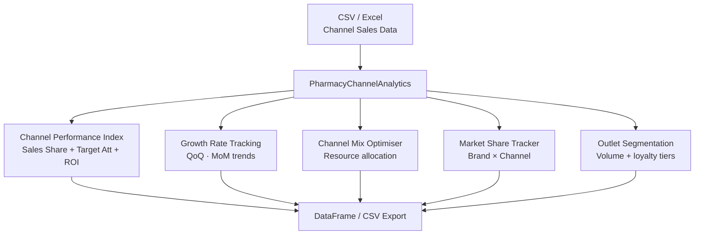

# Pharmacy Channel Analytics

  

Retail, hospital, and online pharmacy channel performance analytics — Channel Performance Index (CPI), period-over-period growth tracking, channel mix optimisation, and ROI benchmarking.

## Features

- **Channel Performance Index (CPI)** — composite 0–100 score combining sales share, target attainment, and ROI
- **Period-over-period growth rates** — quarterly/monthly growth with trend labels (growing/stable/declining)
- **Channel mix optimisation** — resource allocation across hospital, retail, and online
- **Market share tracking** — brand-level share per channel
- **Outlet segmentation** — classify pharmacy outlets by volume and brand loyalty
- **Seasonal demand adjustment** — cycle-adjusted targets
- **Channel ROI analysis** — promotional spend efficiency
- Supports CSV and Excel input formats

## Installation

**Step 1: Clone the repository**
```bash
git clone https://github.com/achmadnaufal/pharmacy-channel-analytics.git
cd pharmacy-channel-analytics
```

**Step 2: Install dependencies**
```bash
pip install -r requirements.txt
```

## Usage

**Step 3: Run the demo**
```bash
python3 demo/run_demo.py
```

**Step 4: Use in your own code**
```python
from src.main import PharmacyChannelAnalytics

analyzer = PharmacyChannelAnalytics()
df = analyzer.load_data("sample_data/channel_performance.csv")

cpi    = analyzer.calculate_channel_performance_index(
             df,
             channel_col="channel",
             sales_col="sales_value",
             target_col="sales_target",
             cost_col="channel_cost")

growth = analyzer.get_channel_growth_rates(df)
```

**Step 5: View results**
All methods return DataFrames — export with `.to_csv("output/channel_report.csv")`.

## Data Format

Expected CSV columns:
```
channel, period, sales_value, sales_target, channel_cost, region
```

## Example Output

```
$ python3 demo/run_demo.py
==============================================================
  Pharmacy Channel Analytics — Demo
==============================================================

✓ Loaded 12 channel records from channel_performance.csv
  Channels : ['Hospital', 'Online', 'Retail']
  Periods  : ['2025-Q1', '2025-Q2', '2025-Q3', '2025-Q4']
  Regions  : ['Java', 'National']

✓ Channel Performance Index (CPI):
  Channel       Total Sales  Target Att%  ROI %   CPI   Band
  -----------------------------------------------------------
  Hospital       2,135,000      103.6%   911.8%  100.0  Excellent
  Retail           800,000      108.1%   561.2%  100.0  Excellent
  Online           280,000      112.0%   566.7%   77.4  Excellent

✓ Period-over-Period Growth Rates:
  Channel    Period       Sales    Growth %  Trend
  ------------------------------------------------
  Hospital   2025-Q1    520,000       base  base_period
  Hospital   2025-Q2    540,000      +3.8%  stable
  Hospital   2025-Q3    510,000      -5.6%  declining
  Hospital   2025-Q4    565,000     +10.8%  growing
  Online     2025-Q1     45,000       base  base_period
  Online     2025-Q2     62,000     +37.8%  growing
  Online     2025-Q3     78,000     +25.8%  growing
  Online     2025-Q4     95,000     +21.8%  growing
  Retail     2025-Q1    180,000       base  base_period
  Retail     2025-Q2    195,000      +8.3%  growing
  Retail     2025-Q4    220,000      +7.3%  growing

✓ Channel Ranking Summary:
  Top performer   : Hospital — CPI 100.0 (Excellent)
                    Sales $2,135,000 | Target 103.6% | ROI 911.8%
  Fastest growing : Online — +37.8% QoQ growth (Q1→Q2)

==============================================================
  ✅ Demo complete
==============================================================
```

## Architecture



## Testing

```bash
pytest tests/ -v
```

---

> Built by [Achmad Naufal](https://github.com/achmadnaufal) | Lead Data Analyst | Power BI · SQL · Python · GIS
